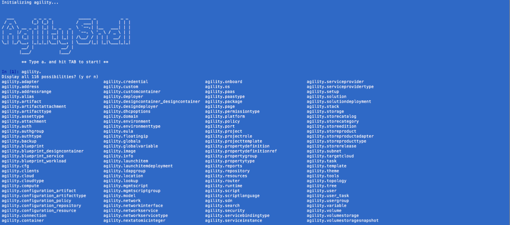
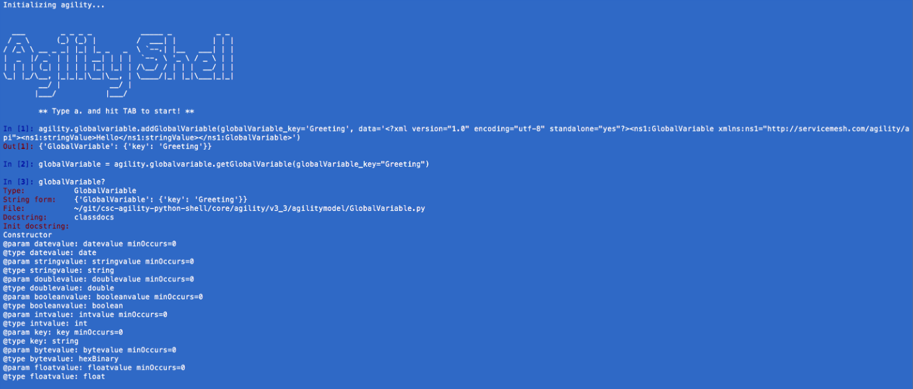
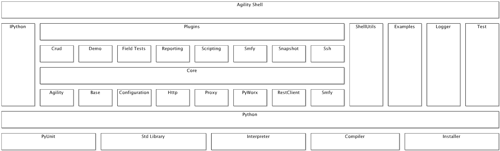

# Agility Shell v2.0
Agility Shell is an interactive command line client used to communicate with Agility Platform's REST API v3.3
## Overview
Agility Shell allows users to explore and use Agility Platform's REST API within a rich interactive environment.  Built on top of the IPython framework, users have access to advanced autocomplete, debugging and development features in addition to all that Python's standard library has to offer.  

The entire set of Agility Platform webservice proxy client objects are pre-loaded at startup and can be accessed through a single object befittingly named "agility". Users discover web services and how to use them by applying IPython's tab completion, object detail and magic commands.  Responses are marshaled into application model objects that can also be explored in the same manner.  

Preserve your environment by taking a snapshot of your data.   Snapshots can be taken across environments and system versions.  Load them to generate custom reports that can be imported into Excel for further analysis.
## Example Usage
* Tab Completion Example (i.e., use tab instead of return):

* Object Detail Example:

## Getting Started
Agility Shell ships with setuptools and a bootstrap script to make things as easy as possible.  After satisfying the prerequisites, a successful installation and proper configuration you should up and running. 

### Prerequisites
The only prerequisite are Agility Platform v10.2.0 and Python v3.4.4.  Research the Agility Platform documentation and the official Python website for installation instructions for your platform.

### Installation
The first thing you're going to want to do is clone the Agility Shell GitHub repository to your work space.
    
    $ cd ${WORKSPACE}
    $ git clone https://github.com/csc/csc-agility-python-shell.git

Agility Shell depends on several Python libraries that include IPython for the interactive shell as well as libraries for XML parsing and date formatting.

For convenience, a setup.py file is included in the root folder of the git repo. The setup.py files uses python setuptools to download dependencies via PyPi (Python Packaging Index). Don’t worry if you don’t have setuptools installed on your system, since the helper file ez_setup.py (also included in the repo) will install it for your platform.

    $ cd csc-agility-python-shell
    $ python setup.py install

After successful installation of all dependencies, copy or rename the example configuration file to agilityshell.cfg.  Modify the configuration to match your environment.   You are now ready to run Agility Shell.

    $ python agilityshell.py [-p path_to_configuration_file]

If you don’t specify an alternative configuration file using the –p flag, the shell will look for the default configuration file with the name agilityshell.cfg in the current directory and use it to connect to the Agility Platform.

### How to run examples and tests
    $ python test/test_generator.py
    
    $ python test/demohowto.py

### Locations of:

> #### Agility Platform v10.2.0

>> scheme:[//host[:port]]/agility/AgilityPlatform.jsp

> #### API v3.3 Reference

>> scheme:[//host[:port]]/doc/rest/core/v3.3

> ### Python v3.4.4 Documentation

>> [https://docs.python.org/3.4](https://docs.python.org/3.4)

> ### IPython v4.0.0 Documentation

>> [https://ipython.readthedocs.io/en/stable/interactive/index.html](https://ipython.readthedocs.io/en/stable/interactive/index.html)

## Design Goals
Providing API SDK on top of any comprehensive, fine grained API increases adoption and encourages automation of repetitive tasks, specially if the SDK is available in a high level language like Python

The Shell has a pluggable architecture, for example via the ssh plugin, it provides a method to execute shell scripts on compute instances, selectively, using the credentials from the CSC-Agility DB

The reporting feature provides a way to preserve the meta-state of an environment, before a major change for the purpose of generating diff reports

Building on top of the CSC-Agility Shell, it's straight forward to develop field test suites to verify system integrity for example through and after an upgrade

Last but not least, the shell is an interactive tool to learn the CSC-Agility REST API's, other than curl. One that would allow navigation and  full manipulation of the XML results

## Detailed Usage

> ### Models and Interface

Dozens of useful objects are pre-loaded for you in the form of an intuitive object graph for interactive exploration. Looking at the instructions you type from another angle, you'd realize that it defines a Domain Specific Language to work with Agility Platform.  

> ### Examples

>> #### Using terms of Shell DSL

Prints the script object, with all its composite attributes expanded into fully qualified names

    a.tools.scripting.flattenmap(scripts[0])

>> #### Exploring Agility

* Autocomplete Service:

Displays a complete list of agility's web services as well as other useful tools.

    agility.<tab>

* Autocomplete Object:

Displays application object methods.

    agility.globalvariable.addGlobalVariable(globalVariable_key='Greeting', data='<?xml version="1.0" encoding="utf-8" standalone="yes"?><ns1:GlobalVariable xmlns:ns1="http://servicemesh.com/agility/api"><ns1:stringValue>Hello</ns1:stringValue></ns1:GlobalVariable>')
    globalVariable = agility.globalvariable.getGlobalVariable(globalVariable_key="Greeting")
    globalVariable.<tab>

* Object Detail:

Displays parameters and available documentation.

    globalVariable?

* Function Detail:

Displays source code.

    agility.tools.scripting.getField??

>> #### Preserving the Environment

    agility.tools.snapshot.new.snapshot(host='localhost', username='admin', password='M3sh@dmin!', systemversion='10.2.0', assetNames=['Script'], clientName='AgilityShell', baseDir='.')

>> #### Generating Reports
    
* Search Report:

    q = query()
    q.params.fieldName = 'name'
    q.params.searchTerm = 'SomeScript'
    q.params.fields = 'id,uuid,name,description,type,body,runAsAdmin'
    from queries.exportcsv import exportSearchResultsCSV, exportCSV
    exportSearchResultsCSV(a, "script", q, "reports")

* Custom Report:

    scripts = agility.tools.snapshot.loadSnapshot("environments/", 'Script', 'localhost', '10.2.0')
    agility.tools.report.<tab>
    agility.tools.report.customReport(scripts, 'script_report.csv', fields=['name', 'id', 'runAsAdmin'])

* Diff Report:

    scripts101 = agility.tools.snapshot.loadSnapshot('environments/', 'Script', 'localhost', '10.1.3')
    scripts102 = agility.tools.snapshot.loadSnapshot('environments/', 'Script', 'localhost', '10.2.0')
    del scripts102[0]
    scripts102[10].id = 'NEW ID'
    scripts102[20].version = '1000'
    scripts102[30].name = 'MODIFIED NAME'
    scripts102[40].runAsAdmin = 'false'
    agility.tools.report.diffReport(scripts101, scripts102, fields=['id', 'name', 'version', 'runAsAdmin'], reportFileName='scripts_report', reportDir='reports', format='csv')

>> #### Running Tests

* Generator Test:

This tests Agility Shell against the currently configured Agility Platform version for incompatibilities.   It pulls the WADL down from Agility Platform and generates web service proxies and application model objects.

    python test/test_generator.py

* Versioned Item Test:

This tests Agility Shell against the currently configured Agility Platform version for versioned asset attribute changes.

    python test/test_versioned_item.py

> ### Configuration

Agility Shell ships with an example configuration file that has pre-configured defaults for security, api version, logging and more.  Copy it and adapt it to your environment.

    cp agilityshell.cfg.example agillityshell.cfg
    vi agilityshell.cfg

> ### Plugins

An Agility Shell plugin is a subdirectory, residing under the '<rootpath>/plugins' parent directory.

>> #### Plugin Configuration

Plugins are loaded and plugin dependancy are resolved based on the plugin configuration file, which is a text file, following the windows ini file format

The configuration file must be named: "plugin.cfg"

The config file can contain one or more "feature" sections, each configuring a new feature endpoint in the agility shell. Section name must follow the pattern feature*

Comments are allowed in the configuration file, a comment line starts with "#"

    [feature_ssh_scp]
    mainmodule = ssh
    mainclass = SSH
    location = a.clients.ssh
    #paths are relative to the plugin home dir
    libpaths = lib, lib/pycrypto-2.6/build/lib.macosx-10.8-intel-2.7, lib/paramiko-1.7.7.1/build/lib/
    #paths are absolute
    extlibpaths = 
    #list of other plugin "locations"
    dependency =

## Developer Info

> ### Conceptual Diagram

> ### Limitations and known issues

